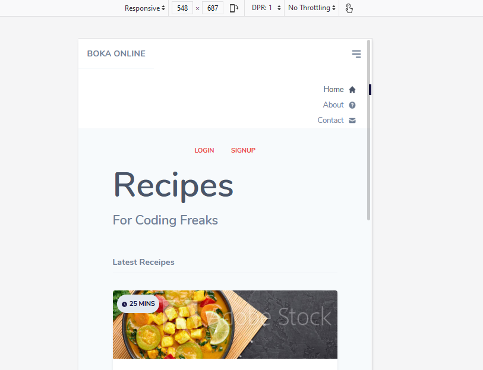

### Tailwind CSS Crash Course 

This is a simple layout from NetNinja while gettings started with Tailwind CSS.

In this series, I learnt the basics of Tailwind.

Here is the site we created.

#### Desktop View

#### Mobile View
